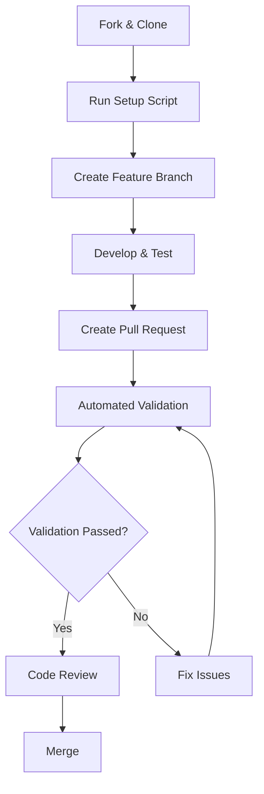

# Enhanced Contribution Workflow

This guide covers the enhanced contribution system for Conciergus Chat, including automated setup, validation, and metrics tracking.

## 🚀 Quick Start for New Contributors

### 1. Initial Setup

Clone the repository and run our automated setup:

```bash
git clone https://github.com/conciergus/chat.git
cd chat
node scripts/contributor-setup.js
```

The setup script will:
- ✅ Verify Node.js and pnpm versions
- ✅ Install dependencies
- ✅ Set up environment files
- ✅ Configure git hooks
- ✅ Install VS Code extensions (optional)
- ✅ Run validation checks
- ✅ Create development helpers

### 2. Understanding the Workflow

Our contribution process includes several automated validation stages:



## 🛠️ Development Tools

### Contributor Setup Script

The automated setup script (`scripts/contributor-setup.js`) provides:

**Features:**
- Environment validation
- Dependency installation
- Development tool configuration
- VS Code extension installation
- Git hooks setup
- Verification checks

**Usage:**
```bash
node scripts/contributor-setup.js
```

### Development Helper

Quick development commands (`scripts/dev-helper.js`):

```bash
# Quick quality checks
node scripts/dev-helper.js quick-check

# Clean reinstall
node scripts/dev-helper.js clean-install

# Full test suite
node scripts/dev-helper.js full-test

# Documentation preview
node scripts/dev-helper.js docs-preview
```

### Contributor Metrics Dashboard

Track project health and contributions (`scripts/contributor-metrics.js`):

```bash
# Interactive dashboard
node scripts/contributor-metrics.js dashboard

# Generate detailed report
node scripts/contributor-metrics.js report

# View contributor leaderboard
node scripts/contributor-metrics.js leaderboard

# Project health analysis
node scripts/contributor-metrics.js health
```

## 🔍 Automated Validation System

### Pull Request Validation

When you open a PR, our enhanced validation system automatically:

#### 1. **Contribution Analysis**
- Analyzes changed files (code, docs, tests)
- Determines contribution type
- Checks if changeset is needed

#### 2. **PR Structure Validation**
- Validates conventional commit format in title
- Ensures required sections in description
- Checks for proper documentation

#### 3. **Code Quality Checks**
- Enhanced ESLint analysis
- Prettier formatting validation
- TypeScript strict checks
- Code smell detection

#### 4. **Test Coverage Analysis**
- Runs comprehensive test suite
- Analyzes coverage metrics
- Uploads coverage reports

#### 5. **Documentation Validation**
- Builds documentation
- Checks for broken links
- Validates TypeDoc comments

#### 6. **Performance Impact**
- Analyzes bundle size changes
- Checks for performance regressions
- Monitors resource usage

#### 7. **Security Validation**
- Security audit checks
- Anti-pattern detection
- Vulnerability scanning

#### 8. **Contribution Summary**
- Generates automated feedback
- Provides improvement suggestions
- Welcomes first-time contributors

## 📋 Contribution Requirements

### PR Title Format

Use conventional commit format:

```
feat: add new feature
fix: resolve bug in component
docs: update API documentation
refactor: improve code structure
test: add unit tests
chore: update dependencies
```

### PR Description Template

Your PR must include these sections:

#### ✅ **Description**
- Clear summary of changes
- Problem being solved
- Solution approach

#### ✅ **Testing**
- Test coverage added/updated
- Manual testing performed
- Verification steps

#### ✅ **Checklist**
- [ ] Code follows style guidelines
- [ ] Self-review completed
- [ ] Documentation updated
- [ ] Tests added/updated
- [ ] Changeset added (if needed)

### Changeset Requirements

For public API changes, add a changeset:

```bash
pnpm changeset
```

**Changeset Guidelines:**
- **patch**: Bug fixes, non-breaking changes
- **minor**: New features, non-breaking additions  
- **major**: Breaking changes

## 🎯 Quality Standards

### Code Quality

- **TypeScript**: All new code must use TypeScript
- **Testing**: Maintain >80% test coverage
- **Linting**: Zero ESLint warnings
- **Formatting**: Use Prettier for consistent formatting

### Documentation

- **JSDoc**: All public APIs must have JSDoc comments
- **Guides**: Update relevant documentation
- **Examples**: Provide usage examples for new features

### Performance

- **Bundle Size**: Monitor and minimize impact
- **Memory**: Avoid memory leaks
- **Rendering**: Optimize React component performance

## 🏆 Contributor Recognition

### Metrics Tracking

We track and celebrate contributions through:

- **Commit Leaderboard**: Top contributors by commits
- **Quality Metrics**: Code quality contributions
- **Documentation**: Documentation improvements
- **Community**: Issue responses and discussions

### Recognition Levels

#### 🥉 **First Contribution**
- Automatic welcome message
- Guidance and support
- Good first issue recommendations

#### 🥈 **Regular Contributor**
- 5+ merged PRs
- Consistent quality contributions
- Community participation

#### 🥇 **Core Contributor**
- 20+ merged PRs
- Significant feature contributions
- Mentorship activities

## 🔧 Advanced Contribution Scenarios

### Large Features

For significant features:

1. **RFC Process**: Create an RFC for design discussion
2. **Task Breakdown**: Use Task Master for planning
3. **Incremental PRs**: Break into smaller, reviewable pieces
4. **Documentation**: Comprehensive docs and examples

### Bug Fixes

For bug fixes:

1. **Issue Link**: Reference the GitHub issue
2. **Reproduction**: Include reproduction steps
3. **Test Coverage**: Add tests to prevent regression
4. **Verification**: Test in multiple environments

### Documentation

For documentation improvements:

1. **Accuracy**: Ensure technical accuracy
2. **Completeness**: Cover all relevant scenarios
3. **Examples**: Provide working code examples
4. **Clarity**: Write for your target audience

## 🚨 Troubleshooting

### Setup Issues

**Node.js Version**
```bash
# Check version
node --version

# Update if needed (recommend Node 18+)
nvm install 18
nvm use 18
```

**pnpm Installation**
```bash
# Install pnpm
npm install -g pnpm@latest

# Verify installation
pnpm --version
```

### Validation Failures

**Build Errors**
```bash
# Clean build
pnpm run clean
pnpm install
pnpm run build
```

**Test Failures**
```bash
# Run tests with detailed output
pnpm test --verbose

# Run specific test
pnpm test -- --testNamePattern="ComponentName"
```

**Linting Issues**
```bash
# Auto-fix linting issues
pnpm run lint:fix
pnpm run format:fix
```

### Git Issues

**Hook Failures**
```bash
# Reinstall hooks
rm -rf .husky/_
npx husky install
```

**Branch Sync**
```bash
# Sync with upstream
git fetch upstream
git checkout main
git merge upstream/main
```

## 📚 Additional Resources

- [Contributing Guidelines](../../CONTRIBUTING.md)
- [Code of Conduct](../../CODE_OF_CONDUCT.md)
- [TypeScript Guide](./typescript-types.mdx)
- [Plugin Development](./plugin-development.mdx)
- [Testing Guidelines](../../test/README.md)

## 💬 Getting Help

**Community Support:**
- Discord: [Join our community](https://discord.gg/conciergus)
- Discussions: [GitHub Discussions](https://github.com/conciergus/chat/discussions)
- Issues: [Report bugs or request features](https://github.com/conciergus/chat/issues)

**Maintainer Support:**
- Tag `@maintainers` in PRs for urgent reviews
- Use `help-wanted` label for complex issues
- Schedule office hours for design discussions

---

**Ready to contribute?** Run the setup script and start building amazing features! 🚀 